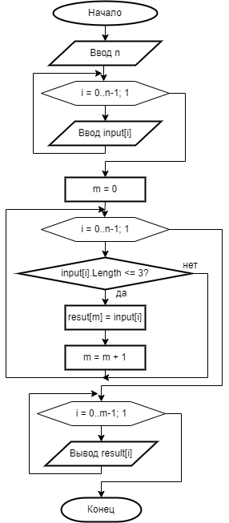

# fnl-test
Final test for GeekBrains
# Final test
+ Create a new Github repository 
+ Draw a block diagram of the task
+ Write a full clear description of your task (Readme.md)
+ Write a program on C#
+ Use Git working on this project. 
_____

>__Note__ that you'd better use different GIT commands and create at least 2-3 *__Git commit__* commands.
_____




>> ## Task:

Write a program that, from the existing array of strings, forms an array of strings whose length is less than or equal to 3 characters. The initial array can be entered from the keyboard, or set at the start of the algorithm execution. 

```c#
using System;
using System.Collections.Generic;
using System.Linq;
using System.Text;
using System.Threading.Tasks;

namespace _1
{
	class Program
	{
		static void Main(string[] args)
		{
			Console.Write("Введите количество строк: ");
			int n = Convert.ToInt32(Console.ReadLine());
			//создаем исходный и результирующий массивы
			string[] input = new string[n];
			string[] result = new string[n];
			//заполняем массив исходными строками
			for (int i = 0; i < n; i++)
			{
				Console.Write("Введите строку №{0}: ", i + 1);
				input[i] = Console.ReadLine();
			}
			int m = 0; //количество отобранных строк
			for (int i = 0; i < n; i++)
			{
				if (input[i].Length <= 3) //если длина строки до 3
				{
					result[m] = input[i]; //добавляем в результирующий массив
					m = m + 1; //+1 строка
				}
			}
			Console.WriteLine("\nСтроки, длина которых меньше или равна 3 символа: ");
			for (int i = 0; i < m; i++)
			{
				Console.WriteLine(result[i]);
			}
			Console.WriteLine("\nДля завершения работы программы нажмите Enter...");
			Console.ReadLine();
		}
	}
}
```


